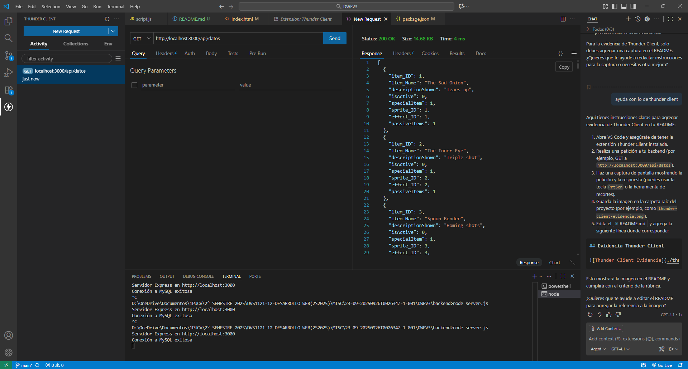

# The Binding of Isaac DB

## Descripción
Proyecto web que consulta y muestra ítems del juego The Binding of Isaac desde una base de datos MySQL. Incluye frontend con Bootstrap, backend en Node.js y Express, y estructura profesional.

## Integrantes
- [Nombres de los integrantes aquí]

## Estructura de carpetas
- `frontend/`: HTML, CSS, JS
- `backend/`: Node.js, Express, SQL
- `datos.json`, `datos.sql`: datos y dump de la BD

## Instalación y uso
1. Instala dependencias en backend: `npm install`
2. Configura MySQL y carga `datos.sql`
3. Ejecuta el backend: `node backend/server.js`
4. Abre `frontend/index.html` en navegador

## Pruebas Thunder Client
Adjunta aquí una captura de las pruebas realizadas con Thunder Client (rutas, respuestas, etc.)

## Evidencia Thunder Client

Para cumplir con la rúbrica, realiza una petición a tu backend usando Thunder Client (por ejemplo, GET a `http://localhost:3000/api/datos`).

Guarda una captura de pantalla de la petición y la respuesta como `thunder-client-evidencia.png` en la raíz del proyecto.

Luego, la imagen se mostrará aquí:

## Filtro DOM
La página permite filtrar ítems por nombre en el portafolio.

## Observaciones
- Las imágenes de los ítems son random por limitación externa.
- Cumple con estructura, semántica, Bootstrap y profesionalismo.

## Licencia
Uso educativo.
